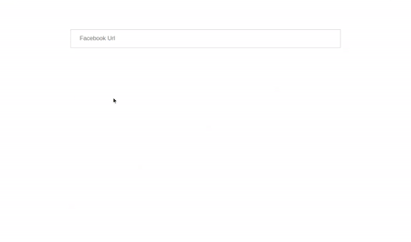

# ReactJS - URL Component

A ReactJS based URL component provides option to add url (like Instagram url, Facebook url, web url, etc.) with validation. The URL value is automatically validated on blur event. You can even disable url field using disable props.

## Table of contents

- [Browser Support](#browser-support)
- [Demo](#demo)
- [Getting started](#getting-started)
- [Usage](#usage)
- [Available Props](#available-props)
- [Methods](#methods)
- [Want to Contribute?](#want-to-contribute)
- [Collection of Components](#collection-of-components)
- [Changelog](#changelog)
- [License](#license)
- [Keywords](#Keywords)

## Browser Support

|  |  |  |  |  |
| ---------------------------------------------------------------------------------------- | ------------------------------------------------------------------------------------------- | ---------------------------------------------------------------------------------------- | ---------------------------------------------------------------------------------- | ---------------------------------------------------------------------------------------------------------------------------- |
| 83.0 ✔                                                                                   | 77.0 ✔                                                                                      | 13.1.1 ✔                                                                                 | 83.0 ✔                                                                             | 11.9 ✔                                                                                                                       |

## Demo

[](https://github.com/weblineindia/ReactJS-URL-Component/url.gif)

## Getting started

Install the npm package:

```bash
npm install react-weblineindia-url
#OR
yarn add react-weblineindia-url
```

## Usage

Use the `<react-weblineindia-url>` component:

```js
import React ,{ Component } from 'react';
import UrlComponent from 'react-weblineindia-url'

class Test extends Component {
  constructor(props) {
    super(props);
    this.state = {
      vData: "",
      isInvalidUrl: false
    };
  }

  onChange(event, isError) {
    this.setState({
      vData: event.target.value,
      isInvalidUrl: isError
    });
  }

  onBlur(event, isError) {
    this.setState({
      isInvalidUrl: isError
    });
  }

  render() {
    return (
      <div>
        <Url
          value={this.state.vData}
          onChange={this.onChange.bind(this)}
          onBlur={this.onBlur.bind(this)}
          placeholder="Enter Url"
        />
        {this.state.isInvalidUrl ? (
          <div className="error-text">
            The URL is not valid
          </div>
        ) : ""}
      </div>
    );
  }
}

export default Test;
```

## Available Props

| Prop           | Type    | default       | Description                                    |
| -------------- | ------- | -----------   | ---------------------------------------------- |
| id           | String    |               | ID for the input                               |
| name         | String    |               | Name for the input                             |
| value        | string    |               | Value of the component                         |
| classname    | object    |               | Class to the input                             |
| placeholder  | String    |               | The input field will get this placeholder text |
| hide         | Boolean   | false         | Hide component                                 |
| disabled     | Boolean   | false         | Disable component                              |
| tabindex     | Number    | 0             | Tab index of the component                     |
| maxlength    | Number    | 25            | The input maxlength                            |
| regex        | RegExp    |               | The input regex                                |
| autocomplete | String    | off           | The input of autocomplelete                    |
| type         | String    | text          | Type for the input                             |
| urlttpe      | String    | 'facebook'    | Default url type for component 'facebook' you can pass 'instagram','web','linkedin','other'.based on that regex will set.if you pass other you have to pass regex value which you want |

## Methods

| Name     | Description                                                      |
| -------- | ---------------------------------------------------------------- |
| onFocus    | Gets triggered when the autocomplete input field receives focus. |
| onBlur     | Gets triggered when the autocomplete input field loses focus.    |
| onChange   | Gets triggered when the autocomplete results got changed.        |
| onKeypress | Gets triggered when a key gets pressed.                          |
| onKeyDown  | Gets triggered when a key gets down.                             |
| onKeyUp    | Gets triggered when a key gets up.                               |

## Want to Contribute?

- Created something awesome, made this code better, added some functionality, or whatever (this is the hardest part).
- [Fork it](http://help.github.com/forking/).
- Create new branch to contribute your changes.
- Commit all your changes to your branch.
- Submit a [pull request](http://help.github.com/pull-requests/).

---

## Collection of Components

We have built many other components and free resources for software development in various programming languages. Kindly click here to view our [Free Resources for Software Development](https://www.weblineindia.com/software-development-resources.html)

---

## Changelog

Detailed changes for each release are documented in [CHANGELOG.md](./CHANGELOG.md).

## License

[MIT](LICENSE)

[mit]: https://github.com/weblineindia/ReactJS-URL-Component/blob/master/LICENSE

## Keywords


react-weblineindia-url, url-component, react-url-component, react-url-input, reactjs-url, react-url
